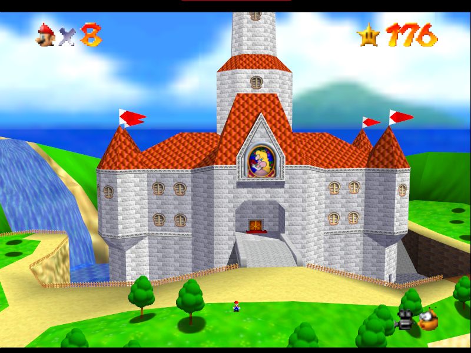

.. _zoom-out-workaround:

Freeze Toggle Zoom-Out Workaround
==================================

Since M64MM uses the internal Pause Camera from the game, some levels such as
Bob-Omb Battlefield will appear zoomed out. Below is an example.

To work around this, enable Powercam before the game starts or in an area that is not
affected by this issue. After this, the camera will not move like it used to do in
the original level, but will allow for freezing the camera normally.

The following is a list of levels affected by this:

* Castle Grounds
* Bob-Omb Battlefield (Course 1)
* Whomp's Fortress (Course 2)
* Cool Cool Mountain (Course 4)
* Lethal Lava Land (Course 7)

  .. note:: Only on the outside. The Inside of Volcano doesn't have this problem.

* Shifting Sand Land (Course 8)
* Snowman's Land (Course 10)
* Wet Dry World (Course 11)

  .. note:: Only on the outside. The Underwater City doesn't have this problem.

* Tall Tall Mountain (Course 12)

  .. note:: Only on the outside. The Secret Slide in this level doesn't have this problem.

* Tiny Huge Island (Course 13)
* Rainbow Ride (Course 15)
* Wing Mario Over The Rainbow
* Tower of the Wing Cap (Wing Cap Course)
* All Bowser Stages

	* All Bowser Arenas

.. note:: This may not be the case in other ROM hacks. The levels with zooming-out may be different, or there may be none at all.