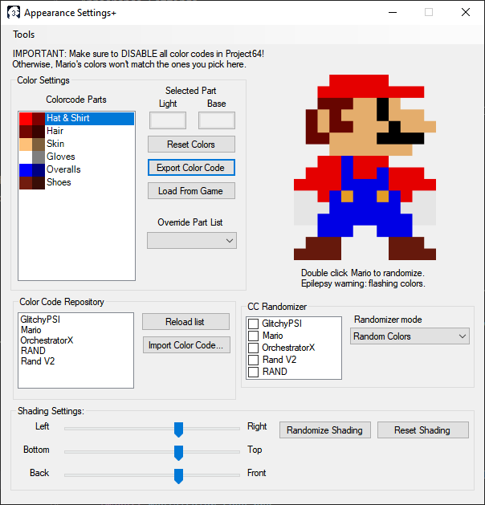
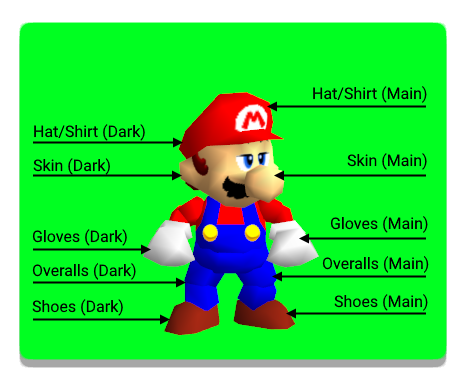

Appearance Settings
============================

This is a window that allows you to edit Mario's appearance, such as his colors and shading. This window can only be accessed if:

* The game's ROM is opened
	
	* Only if the ROM opened has a regular Mario model, such as Cjes' Luigi or the original Mario model; a SPARK mod such as SPARK Mario, or a CometX3 + Shading mod. Otherwise it may not work or yell about it.

.. _colorsettings:

Color Settings
##############

Color part list and Light/Base buttons
^^^^^^^^^^^^^^^^^^^^^^^^^^^^^^^^^^^^^^

Here you'll find the Shadow and Main colors for Mario. Clicking the items in
the list will change the boxes for Light and Base, and clicking on either of
those will pop up a color dialog that'll allow you to change Mario's color code
in real time.

.. warning:: Disable any Color Code cheats in PJ64! Not doing so will render
	any changes you make in M64MM useless as they will be instantly overwritten
	by the selected cheats.

* **Light**
	
	Represents the Light color. Imagine it as the color of the light that
	hits the object.
	
* **Shadow**

	Represents the Base color. Imagine it as the base color of the object.

Here is an overview of what changes when you change any of the color boxes
(for Classic color codes):

.. note:: Textures are not affected by the color codes (Such as the Hat's M, the eyes, moustache,
	buttons on the overalls or sideburns). Those must be edited within the ROM or using a graphics
	plugin that supports texture loading.

.. note:: SPARK Colorcodes are a different kind of color code that can be
	considerably longer, but allow you to edit way more parts in mods that are
	compatible with such.

* **Reset Colors**

This button resets the built-in color code. (By default, Mario's default colors are stored in here.)

.. warning:: Only color codes. Any other kind of Gameshark will not be read by M64MM.

* **Export Color Code**

This button generates the color code from the color boxes for sharing or to use
as a Gameshark cheat code in your emulator. You can also save as file.

* **Load From Game**

This button loads the color code from the game using the specified parts.

* **The Big Mario Next To The Color Code Part List**

This Mario sprite has two purposes: Show a small fancy preview of how your color code looks like,
and to randomize the color code's colors, or between color codes from a chosen list.

To start the randomizer, double click the sprite. Rainbows!
To stop it, double click the sprite once more.

.. warning:: Flashing colors warning: This feature may trigger epileptic seizures for some users.
	Use at your own risk.

* **Override Part List**

If, by any chance, you have started a ROM that is compatible with SPARK or X3S and the part list
does not correspond to your model, you can change the list of parts that show in the Appearance
Settings here at any time.

.. warning:: Using incompatible parts may result in distortions to the model or incomplete colors.
	Not all mods are CometX3 + Shading compatible.

Color Code Repository
^^^^^^^^^^^^^^^^^^^^^

* **CC List**
  
This list has all colorcodes that are in .txt files inside your ``/Colorcodes`` folder next to
``M64MM.exe``. Doubleclick a name to apply that colorcode with the current color code parts.

* **Reload List**

This reloads all colorcodes inside the ``/Colorcodes`` folder and puts them in this list.

* **Import Color Code**

This button allows you to paste in a color code to load it in the game as if it
were just a cheat code. M64MM will read the code and will apply it. You can also
read from a file.

This box supports normal colorcodes and SPARK colorcodes.

Color Code Randomizer
^^^^^^^^^^^^^^^^^^^^^

* **CC List**
  
This list synchronizes with the one from the CC repository. Check the boxes to select which
color codes to put in the list of color codes to pull from when randomizing color codes.

* **Randomizer mode**

Selects what to randomize, between all random colors, or random color codes from the checklist.

Shading Settings
^^^^^^^^^^^^^^^^

These controls will allow you to tweak the direction of the light Mario is using.

.. note:: Only Mario. Level lighting is not affected.

Imagine that the light Mario is using is an invisible lamp. These controls decide *where* around
Mario's body this light is located.

.. note:: The sliders refer to the camera position, not Mario's model. If you turn the camera,
	the shading won't move along.

.. image:: media/shading.gif
	 :width: 465px

* **Randomize Shading**

Gives random values to the sliders. Not automatic, unlike the Color randomizer.

* **Reset Shading**

This restores the shading values to the normal ones Mario uses.

	
