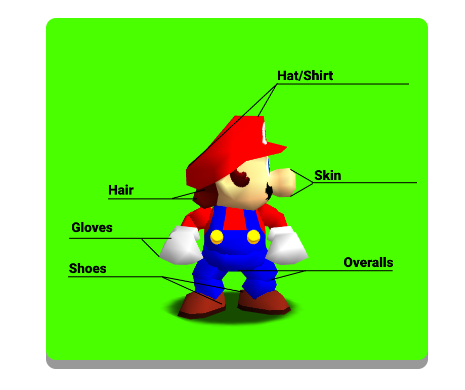

Appearance Settings
============================

This is a window that allows you to edit Mario's appearance, such as his colors and shading. This window can only be accessed if:

* The game's ROM is opened
	
	* Only if the ROM opened has a regular Mario model, such as Cjes' Luigi or the original Mario model. Otherwise it may not work or deny its usage.

.. _colorsettings:

Color Settings
##############

Color boxes and buttons
^^^^^^^^^^^^^^^^^^^^^^^

Here you'll find the Shadow and Main colors for Mario. Clicking the boxes will pop up a color dialog that'll allow you to change Mario's color code in real time.

.. warning:: Disable any Color Code cheats in PJ64! Not doing so will render any changes you make in M64MM useless as they will be instantly overwritten by the selected cheats.

* **Main**
	
	Represents the Light color.
	
* **Shadow**

	Represents the Dark color.

Here is an overview of what changes when you change any of the color boxes:

.. image:: media/color_code_2.png

.. note:: Textures are not affected by the color codes (Such as the Hat's M, the eyes, moustache, buttons on the overalls or sideburns). Those must be edited within the ROM or using a graphics plugin that supports texture loading.

* **Import Color Code**

This button allows you to paste in a color code to load it in the game as if it were just a cheat code. M64MM will read the code and will apply it.

.. warning:: Only color codes. Any other kind of Gameshark will not be read by M64MM.

.. note:: M64MM will ask you if you wish to set these colors as default colors when you load a new color code this way. Agreeing to do this will change which color code the button "Reset Colors" will apply. Do note that this will remain the "default colors" while M64MM is open. Once you close it, the default colors turn to be Mario's again.

* **Export Color Code**

This button generates the color code from the color boxes for sharing or to use as a Gameshark cheat code in your emulator.

* **Reset Colors**

This button resets the default color code. (By default, Mario's colors are stored in here.)

* **Load From Game**

This button loads the color code from the game. It behaves similarly to "Import Color Code".

* **The Big Mario Next To The Color Code Boxes**

This Mario sprite has two purposes: Show a small fancy preview of how your color code looks like, and to randomize the color code.

To start the randomizer, double click the sprite. Rainbows!
To stop it, double click the sprite once more.

.. warning:: Flashing colors warning: This feature may trigger epileptic seizures for some users. Use at your own risk.

Shading Settings
^^^^^^^^^^^^^^^^

These controls will allow you to tweak the direction of the light Mario is using.

.. note:: Only Mario. Level lighting is not affected.

Imagine that the light Mario is using is an invisible lamp. These controls decide *where* around Mario's body this light is located.

.. note:: The sliders refer to the camera position, not Mario's model. If you turn the camera, the shading won't move along.

.. image:: media/shading.gif
	 :width: 465px

* **Reset Shading**

	This restores the shading values to the normal ones Mario uses.
	
* **Randomize Shading**

	Gives random values to the sliders. Not automatic, unlike the Color randomizer.
	
