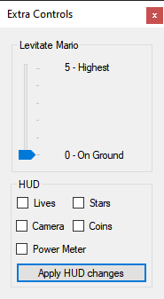

Extra Controls
==============

These are miscellaneous controls that aren't as powerful as the other features in the
program, but prove useful for machinimists.

Levitate Mario
##############

This allows you to make Mario float. Useful for animations that clip in the ground,
or want to get a bottom angle of an animation.

.. note:: Some animations are restricted in the ground because of how the game treats
	them. METAL Composer's Animation Override bypasses some of this.

* **Slider from 0 to 5**

	0 is regular height, 5 is max height.
	
	.. warning:: This may make some animations be extremely bouncy. This behavior is
		because of how the game treats animations.
	
HUD
##############

* **Apply HUD button and checkboxes**
	
	This button adjusts the visibility the in-game HUD, allowing for recording without
	the counters for stars, lives or POWER meter.
	
	.. note:: Does not affect the black bars.