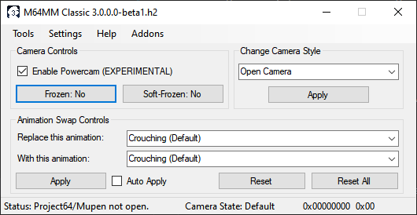

User Interface Overview
============================

Main Window
############

When starting M64MM2.1, you will first be greeted by the main window.

Camera controls
^^^^^^^^^^^^^^^

        These are the main controls for M64MM that you'll be using the most.

        * **Freeze (CTRL+1)**

            This will freeze the camera and not allow the angle to be moved.

            .. warning:: This breaks in some levels, like Bob-Omb Battlefield. There is a workaround to this which can be found here.

        * **Unfreeze (CTRL+2)**

            This is the opposite of Freeze. It unlocks the camera if it was frozen normally.
            It will also take you out from the C-Up mode (First Person).

        * **Soft-Freeze (CTRL+4)**

            This option was introduced in 2.0.
            This works similarly to Freeze, except the angle isn't frozen.
            It's useful to keep the camera static in one place while turning the angle.
            Unlike regular Freeze, this works in all levels.

        * **Soft-Unfreeze (CTRL+5)**

            This option was introduced in 2.0.
            This is the soft version of the Unfreeze button.
            It simply unlocks the camera (Does not take out C-Up mode).

Change Camera Style
^^^^^^^^^^^^^^^^^^^

        Previously known as **"Change Camera Style (CTRL+3)"**
        in versions prior to 2.0.5.1, allows you to change the
        Camera Style of a level with one of the integrated modes from SM64.

Animation Swap controls
^^^^^^^^^^^^^^^^^^^^^^^

        These controls assist you with animation swapping
        without having to edit the game's ROM.

            * **"Replace this animation..."**

                The animation in-game to be replaced.

            * **"With this animation..."**

                The animation in-game to replace with.

            * **Apply**

                Applies the currently shown animation swap.

            * **Reset**

                Returns the animation in "Replace this animation..."
                to its original state.

            * **Reset All**

                Returns all animations back to their default animation.

            * **Restart Animation**

                Resets the animation by making Mario T-Pose for a single frame.

                .. note:: This is improved in M64MM3!

            .. note:: Swapping animations depends on Mario's actions. For example, changing the Crouching animation to Swimming will not make any new animation you replace with Crouching be Swimming.
                        It will only affect the original place where this animation is played.

Status Bar
^^^^^^^^^^
    * **Status**

        Says whether Project64 is open or the program
        is waiting for a level to work.

        Additionally, shows the base address (RAM) of the game once it starts.

    * **Camera status**

        Highlights the current camera status.

Menu Strip
^^^^^^^^^^
    M64MM by default locks some functions until the
    game is ready to be used normally.

    When coming to buttons, their functionality just stops.

    * **Tools**

        Locked by default.

        Has some tools like the Appearance Settings and Extra Controls.

    * **About**

        Shows information about the program and some credits.
