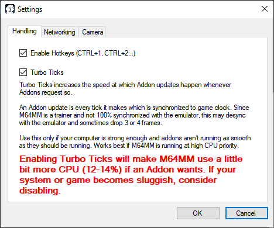
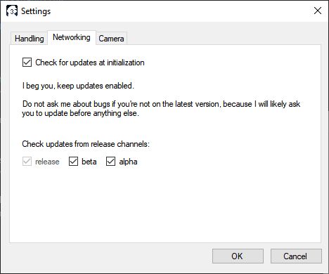
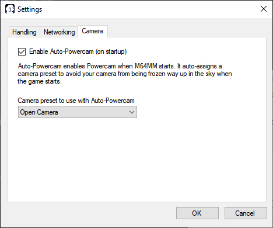

Settings panel
============================

This panel allows you to change the behavior of some of M64MM's features. It has many
tabs for this purpose.

.. _settings-handling:

Handling
############

Enable Hotkeys
^^^^^^^^^^^^^^

Allows you to change whether M64MM will read the hotkeys. Useful if the hotkeys interfere
with your setup.

Turboticks
^^^^^^^^^^

Turbo Ticks makes Addon updates (which control what Addons do in an in-game frame) more
aggressive, at the cost of using more CPU. Used mostly to make Addons run smoother.

Networking
############

Check for updates at initialization
^^^^^^^^^^^^^^^^^^^^^^^^^^^^^^^^^^^

Makes M64MM check for updates after the splash screen shows up.

.. warning:: Please **DO NOT DISABLE THIS!!** I understand some people hate updates, but
    listen to me: M64MM is software that is in-development. It's best if you check if you
    have any pending updates before reporting any issues in the GitHub Issues!

    At least wait until M64MM is no longer in pre-release status.

Release channels
^^^^^^^^^^^^^^^^

Makes M64MM check for updates only in the specified release channels, so this is opt-in.

Camera
############

Auto-Powercam and A-PC Camera Preset
^^^^^^^^^^^^^^^^^^^^^^^^^^^^^^^^^^^^

Auto assigns a camera preset to apply when the game starts, as well as Powercam.

